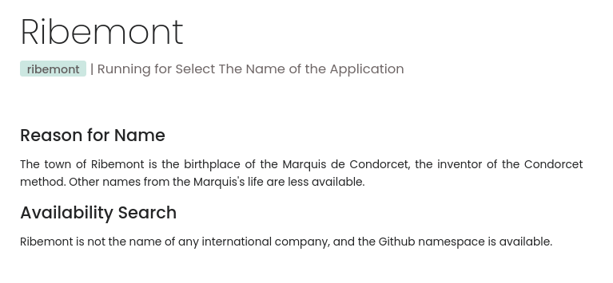
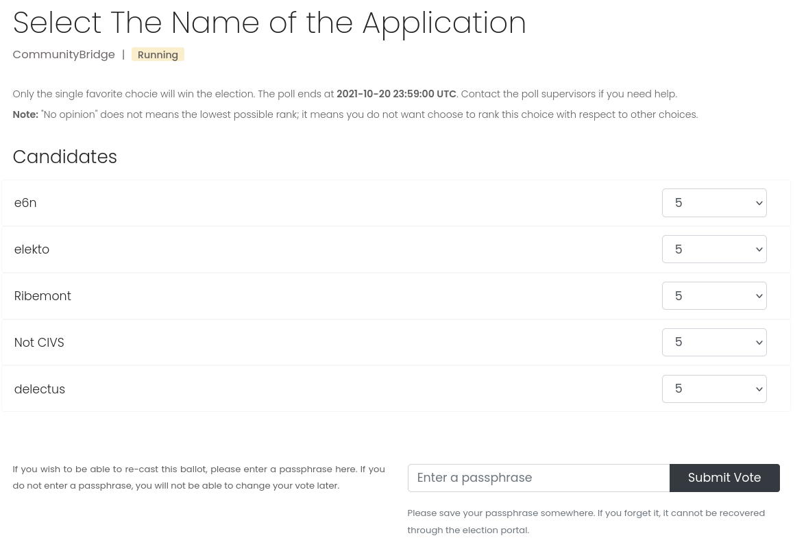

# Voting With Elekto

What follows is a User Guide for regular voters using Elekto to vote. This guide assumes that you have been directed to a particular Elekto site running an election for your organization.

Voting with Elekto is designed to be easy and as intuitive as a preference election can be.

## Log In

Elekto uses Oauth authentication against an external provider chosen by your administrator.  In most cases, the provider is GitHub, and these docs will assume that's the case.

When you access Elekto, you are presented with a login screen that requests you to "Sign In With GitHub".  Click on that button.

The first time you log in to a particular Elekto site, you will be asked by your provider (GitHub) to verify your identity.  Generally that means logging into the provider and authorizing Elekto to verify your identity there. You need to authorize, or you will not be able to use Elekto. After that first time, simply clicking the button is sufficient to log you in.

## Find The Election

Elekto navigation is on the left on a desktop interface.  On mobile, there is a pull-down menu.

To access current and future elections, select "Explore Election" on the left.  Historical elections (that is, ones where all voting is closed) can be found under "Past Elections".

If you select Explore Election, you'll be presented with a list of one or more upcoming or currently voting elections in your organization. These elections are not filtered by your voter status, so you will be able to see elections where you cannot vote. The list shows election names, organization or team (in case your community has multiple teams with different elections), status, and the dates that the election is open for voting. Statuses are:

* Upcoming: voting in this election has not started yet
* Current: voting is open
* Completed: voting is closed

All dates and times are UTC.

Find the election you are interested in in the list, and click its name.

## Viewing an Election

The Election screen packs a lot of information into a compact screen.  See the illustration below which explains what all the parts of the interface are:

Here's the important parts of the interface:

* Title of the Election
* Organization, in case your community has multiple teams of people voting on things
* Election Status (see above)
* Voter Status: "Eligible" if you can vote in this election, "Not Eligible" if you can't
* Election description, written by your election administrators
* List of Candidates (see below)
* Voting dates in the election
* Vote button: only appears when the election has started, and if you are eligible

There are two actions you can take before an election starts: browsing candidate profiles, and requesting a voter qualification exception.

## View Candidate Profiles

Below the election description there is a list of candidates in random order.  Click on any of these candidates to see the profile they submitted to the election.  This profile opens in a new tab in most browsers, in order to prevent you from resetting an incomplete ballot if you click on a profile in the middle of voting.

The Candidate profile consists of at least the candidate's name, their GitHub handle, and a self-written description of the candidate and their qualifications. Depending on your organization's requirements, it may contain other pieces of required information, such as their employer, Slack handle, or years of membership. These profiles are submitted as PRs through the election repository, so if you don't see a profile for a candidate, that usually means that they haven't submitted one yet.

Close the tab to exit the candidate profile.

## Asking for Exceptions

The election screen displays if you are ineligible to vote:

Many organizations have a process whereby a member of their community who does not initially qualify for voter eligibility can request an exception to the requirements in order to vote.  You can do this through Elekto.

If the election information page shows "Not Eligible", then there will also be a link you can click to request an exception.  This form will ask for some contact information for you (so that the election officers can reach you) and has a large text box for you to explain why you are qualified for an exception.  What information you need to put there depends on your organization.

There is also a deadline for exception requests, which may be before the deadline for voting.  If you attempt to request an exception after that date, the form will not be available.

## Vote

Once the election has started, you can cast your vote for your preferred candidates. From the election information screen, click the button that says "Vote".

Elekto manages preference elections, where you choose candidates in order of which one you'd prefer most.  This means that, rather than just checking off a candidate, you need to rank all candidates in order of your preference.  While decisions about who you would prefer to whom are up to you, the Elekto UI offers you two ways to save that ranking and cast your ballot.

* Click-and-drag: you can drag candidate names up and down to resort them. Elekto will do its best to rank them based on where you've placed them, but can sometimes get numerically confused.  If that's an issue, use the second method.
* Numerical Ranking: next to each candidate is a numbered drop-down.  You can select a number ranking for each candidate, with "1" being your most preferred candidate, and higher numbers being less preferred.

You are allowed to "tie" two candidates, giving them the same number ranking, if you cannot decide between them.  Depending on your election officers' settings, you may also use "No Opinion" to indicate candidates that you know nothing about and thus cannot rank them.  Otherwise, please do try to rank all candidates, as this allows Elekto to select a most preferred candidate without a deadlock.

When you have finished ranking candidates, you may optionally enter a passphrase that will allow you to re-cast your vote.  This passphrase is used to encrypt the link between your account and your vote, so that the Election Officers are unable to eavesdrop on your specific ballot. If you enter a passphrase, you need to remember it or write it down because it is not retrievable via Elekto.  If you know that there is no chance you will want to re-do your ballot before the election is over, then you can leave the passphrase empty.

## Re-Casting Your Vote

Elekto allows you to revoke and re-cast your vote for as long as the election is open.  This way, you can vote when it opens, and update your vote if you learn new information about candidates.

In order to ensure that this doesn't compromise the privacy of your ballot, though, the link between your identity and ballot are encrypted with a passphrase you supplied when you voted (see above).  As such, you must enter that passphrase in the field in the election UI in order to revoke your vote.  If you didn't set one, or cannot remember it, you cannot re-cast your vote.  Administrators will not be able to help.

If you enter your passphrase, and click "Revoke", your original ballot will be deleted.  You can then select "vote" in order to cast your ballot again.

## Checking the Results

As soon as the election ends, the Election Officers will be sent the results of the election.  However, since organizations have complex rules, including corporate representation limits, requirements for diversity, and limits on disclosure of absolute rankings, you will not be able to see the results as a voter until a hand-edited version of them is published by an Election Officer.

Once it is published, the results will be available via a link from the election information page.
